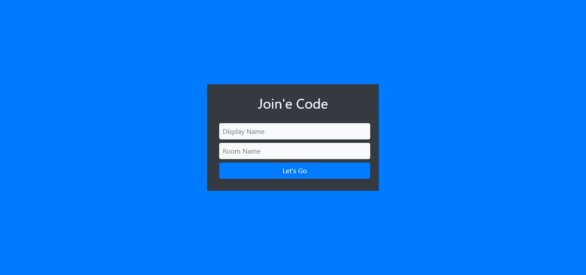
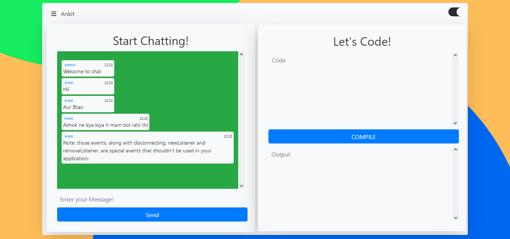

# CodeChat

A Web Application that allows the users to Chat and Code at one place.


## Authors

- [@RamGoel](https://www.github.com/RamGoel)


## Run Locally

Clone the project

```bash
  git clone https://github.com/RamGoel/CodeChat.git
```

Go to the project directory

```bash
  cd CodeChat
```

Install dependencies

```bash
  npm install
```

Start the server

```bash
  nodemon index
```


## Live View

[View Live](https://codechatapp.herokuapp.com/)


## Features

- Light/dark mode toggle

- Cross platform
- Mostly Programming Language Support
- Users can make Groups
- No Page Refresh
- User JOIN/LEAVE Notifications
- Attractive UI


## Screenshots




